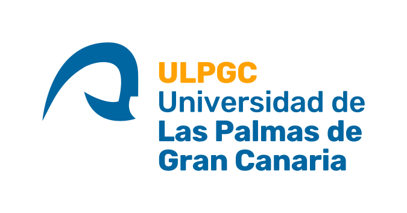

# Dedication Block

Estimates and reports time spent by participants in a Moodle course, based on
log-entry session analysis.

## Fork Information

This is a fork of the [Catalyst IT dedication block](https://github.com/catalyst/moodle-block_dedication),
maintained by the University of Canterbury.

### Why we forked

The upstream plugin includes **all enrolled users** (staff, coordinators, admins)
in dedication calculations. Our use case requires filtering by configurable roles
so that only student activity is measured. The upstream maintainers have not
adopted this feature.

### Key differences from upstream

1. **Configurable role filtering** - site administrators can select which roles
   are included in dedication calculations via the `rolespecify` multi-select
   setting. Upstream includes all enrolled users indiscriminately.
2. **Performance optimizations** - composite database index on
   `(courseid, timestart, userid)` and optimised SQL queries for session
   aggregation.
3. **ACE integration** - optional hook into the local_ace filter system for
   cohort-filtered dedication averages.
4. **Cleanup task fix** - upstream issue #115 (infinite loop in the cleanup
   scheduled task) is fixed in this fork.
5. **ReportBuilder system reports** - course and user-level reports use Moodle's
   `core_reportbuilder` API.

### Upstream issues addressed

| Issue | Description | Status in this fork |
|-------|-------------|---------------------|
| #115  | Cleanup task infinite loop due to inverted `min()` logic | Fixed |
| #116  | Memory exhaustion on large courses | Partially mitigated via weekly chunking in `generate_stats()` |
| #126  | Session fixation security concern | Not applicable - plugin uses log-based session detection, not PHP sessions |

## How dedication time is estimated

Time is estimated using session analysis applied to Moodle's log entries:

- **Click**: each page access generates a log entry.
- **Session**: consecutive clicks where the gap between each pair does not exceed
  the configured session limit (default: 1 hour).
- **Session duration**: elapsed time between the first and last click of a session.
- **Dedication time**: the sum of all session durations for a user in a course.

Sessions shorter than the configured minimum (default: 1 minute) are excluded.

## Features

- Students can view their own estimated time spent in the block.
- Teachers can access a course-level report showing dedication for all students.
- Per-student session detail reports with start time and duration.
- Reports are downloadable in spreadsheet format.
- Data is generated via a scheduled task for performance.
- Custom ReportBuilder datasource available for site-level reporting.

## Requirements

- Moodle 4.4 or 4.5
- `logstore_standard` or `logstore_standardqueued` log store

## Branches

| Moodle version    | Branch              |
|-------------------|---------------------|
| Moodle 4.0 - 4.3  | `MOODLE_400_STABLE` |
| Moodle 4.4 - 4.5  | `MOODLE_404_STABLE` |

## Credits

Originally developed by Aday Talavera (CICEI, Universidad de Las Palmas de Gran Canaria). First version for Moodle 1.9 by Borja Rubio Reyes.

Moodle 4.0+ release developed by Catalyst IT with funding from the University of Canterbury.

Ongoing development and maintenance by the University of Canterbury as part of the ACE (Analytics for Course Engagement) suite.

## License

2022 University of Canterbury

This program is free software: you can redistribute it and/or modify it under the terms of the GNU General Public License as published by the Free Software Foundation, either version 3 of the License, or (at your option) any later version.

See <https://www.gnu.org/copyleft/gpl.html> for details.
